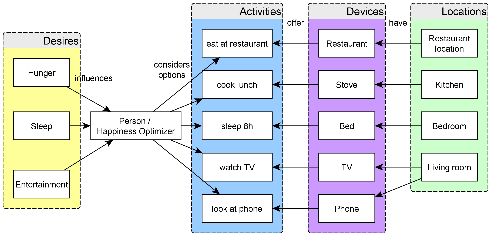

# Summary

A load profile contains a value for each step in time that describes how much energy was consumed in that time step. There are load profiles for example for electricity, gas, heat demand and other load types.
This is critical input data for a lot of research applications. For example, the car charging load profiles have a very strong influence on the self-consumption
for a photovoltaic system, as has been shown in [@pflugradt_impact_2019]. 

This paper describes the LoadProfileGenerator (LPG), an application for creating synthetic residential load profiles. It uses a behavior-driven agent simulation 
to model the behavior of the residents in detail and generate load profiles with a high temporal resolution of 1 minute for the residential energy consumption, primarily electricity and domestic hot water. 
Additionally, it generates behavior data, travel data and location data. 

The LPG comes with 60 predefined households, validated for Germany. The households in the LPG are fully customizable and can be defined 
by specifying people and their traits. Examples for traits are "alarm at 7am", "sleeps 8h" or "works at the office from 9-5". 
There are over 400 traits predefined and more can be added by the user. To enable the modelling of a large number of households, 
the LPG contains functions to automatically create new household definitions from the traits, which is described in more detail below. 
The LPG is written in C# and has about 60.000 lines of code. 

The LPG does not currently contain a detailed heating demand simulation, since that field is already covered in detail by other tools such as TRNSYS, Polysun or EnergyPlus.

# Statement of need

Load profiles are used by researchers, planners and others. They are used for modelling building energy systems, interactions with the electricity, gas or district heating grids, 
when trying to develop new technologies such as energy management systems or smart grid control algorithm and in many other applications.

Averaged profiles over a larger group of individual households are not an option for many applications such as system simulation and analysis with a high spatial resolution, since they have a significantly different shape than real individual load profiles, as shown in \autoref{fig:hzero}.

![Difference between the average over many households and measurements from a single household. The high peaks are from cooking. [@pflugradt_modellierung_2016] .\label{fig:hzero}](h0vsmeasurement.png)

For most applications it would be ideal to have access to measured data.  But such data is frequently not available. Reasons for that include
privacy concerns, data availability, lack of instrumentation or, especially in research about future energy systems  
that  the situation simply doesn't exist yet and thus can't be measured. Especially in the residential area privacy is a major concern since is easy to 
draw detailed conclusions about the life of the residents from the load profiles. If no measured data is available, then the creation of synthetic profiles is the only solution.  

The `LPG` aims to solve these problems by providing a free and easy to use tool that enables researchers and planners to generate custom profiles very quickly.

There are a number of different tools for load profile synthesis available, such as CREST [@mckenna_high-resolution_2016] or Synpro [@fischer_stochastic_2016], but the LPG introduced in this paper is to the best 
knowledge of the authors the most detailed and the only one using a full desire-driven behavior simulation based on a psychological model.

## Examples for Previous Usage

The LPG has been used in many papers for various applications. To demonstrate what the LPG can be used for, six citing papers have been selected that give a good overview of the possible applications:

- [@harder_cost_2020] analyzed operating flexibility in electricity grids. 
- [@bockl_hyflowhybrid_2019] generated load profiles for an evaluation of sector coupling.
- [@lovati_optimal_2020] used the model to evaluate peer-to-peer electricity trading while considering the influence of lifestyle.
- [@boeckl_sizing_2019] evaluated the optimal size of photovoltaic systems for different load profiles. 
- And building on that [@lovati_design_2020] evaluated the impact of the load profile on optimal photovoltaic system operation.
- [@haider_data_2020] analyzed optimal ways of charging electric cars.
  
# Method

The LoadProfileGenerator (LPG) implements a desire-driven human behavior model to simulate when people are doing what and where they are. 
The basic algorithm for selecting an activity is shown in \autoref{fig:happiness}.

The behavior of the residents is used to calculate energy consumption and generate the load profiles by combining synthetic and measured device profiles. 
This is combined with additional details for more realistic behavior modelling, such as illnesses, vacations, joint activities between multiple residents such as eating dinner together, 

The LPG  was originally developed in the context of a PhD-thesis [@pflugradt_modellierung_2016] and has since then been extended and improved. 

# Novelty of this publication

The LPG has been in development since 2010, and an open access GUI based version available free of charge the entire time at http://www.loadprofilegenerator.de. In February 2020 the LPG was open-sourced under the MIT-License. This is the first publication describing the LPG as an open-source tool, now available at https://github.com/FZJ-IEK3-VSA/LoadProfileGenerator. 
Contributions and merge requests are greatly appreciated.

# Acknowledgements

From 2010 to 2013 the development was supported by the Technische Universität Chemnitz, Professur Technische Thermodynamik in Germany.
From 2016 to 2020 the development was supported by the Berner Fachhochschule, Laboratory for Photovoltaik Systems in the research project SimZukunft in Switzerland.
Starting form March 2020 the development has been supported by the Forschungszentrum Jülich GmbH - Institute for Energy and Climate Research, Techno-Econonomic System Analysis - IEK 3.

# References